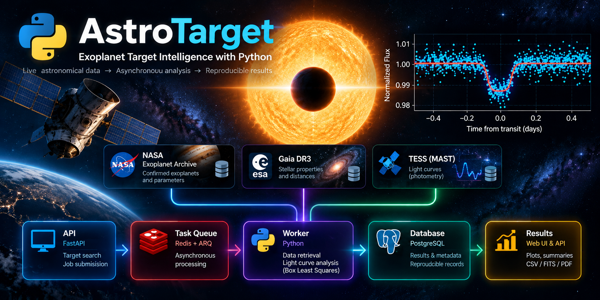

# AstroTarget v0.3.5

<p align="center">
  
</p>


**Research-oriented exoplanet target intelligence:** NASA Exoplanet Archive + Gaia DR3 + TESS/MAST, with PostgreSQL persistence, Redis background jobs, provenance, reproducibility metadata, scientific exports, Docker and CI.

## What a run does

1. Queries the live NASA Exoplanet Archive `pscomppars` table through TAP/ADQL.
2. Uses NASA's Gaia DR3 identifier directly when available; otherwise performs the official DR2→DR3 `gaiadr3.dr2_neighbourhood` mapping; only then falls back to a coordinate/G-magnitude cone match.
3. Searches live MAST for official TESS SPOC light curves with Lightkurve, downloads PDCSAP flux, applies the default TESS quality mask, normalizes, removes strong positive outliers, and flattens while masking known transits.
4. Runs a catalog-guided Astropy BoxLeastSquares transit analysis around the known orbital period (when available) and compares the recovered period with the catalog value.
5. Stores normalized metadata/results in PostgreSQL and queues long-running work through Redis/arq.
6. Exposes status/results via FastAPI and exports CSV, FITS, JSON, PNG and a PDF research report.


## NASA schema note

AstroTarget deliberately keeps its `pscomppars` TAP query to fields used by the
pipeline. In particular, it does **not** request `pl_tsystemref`. NASA's table
mapping distinguishes time-system/reference fields between the PS and
PSCompPars products; adding unused fields increases the risk of coupling the
client to the wrong table schema. Transit-aware TESS processing currently uses
`pl_tranmid` and converts a full BJD/JD-style value to BTJD where appropriate.

`pl_refname` is also intentionally excluded: NASA documents it for the PS table, not PSCompPars. AstroTarget does not substitute a discovery reference for it because that would change the scientific meaning.

## Important correctness fixes

- NASA's current fields are `gaia_dr2_id` and `gaia_dr3_id`; the old v0.2 `gaia_id` query was wrong.
- The live PSCompPars query no longer requests PS-only `pl_refname`; this fixes the HTTP 400 found by the v0.3.2 live smoke test.
- Non-retryable upstream 4xx errors now fail immediately and include a bounded upstream response body, making TAP/ADQL schema errors diagnosable.
- A direct NASA Gaia DR3 identifier is now preferred over any heuristic cross-match.
- NASA transit midpoint is converted from full JD/BJD to TESS BTJD (`BJD - 2457000`) before transit-aware flattening.
- NumPy light-curve arrays are no longer inserted into PostgreSQL JSONB; arrays remain in the binary light-curve record while JSON contains only serializable metadata/results.
- Every analysis execution creates a new `analysis_runs` row. Scientific runs are not overwritten just because the software version is unchanged.
- Schema creation was removed from FastAPI/worker startup. Alembic is the single schema authority.
- TESS cadence is no longer hard-coded to 120 seconds; current Lightkurve `exptime='short'` is tried first and actual search metadata are recorded.
- `/health` checks PostgreSQL and Redis, not merely the web process.
- Optional API-key protection and Redis-backed submission rate limiting are included for public deployment.

## Start on Windows with Docker Desktop

Copy `.env.example` to `.env`. For local-only use you may initially leave `ASTROTARGET_API_KEY` empty. Then, from the project folder:

```powershell
docker compose up --build
```

Compose starts PostgreSQL and Redis, waits for them to become healthy, runs `alembic upgrade head`, then starts the API and worker.

Open:

- UI: `http://localhost:8000/ui/`
- interactive API documentation: `http://localhost:8000/docs`
- dependency health: `http://localhost:8000/health`

Try `WASP-12 b`, `HD 209458 b`, or another confirmed planet present in the NASA Exoplanet Archive.

## What “live access” means

The application does **not** contain a copied NASA/Gaia/MAST catalog. Each new queued analysis calls the public archive endpoints at run time. PostgreSQL is your local durable database for the retrieved target, provenance and analysis results. Redis is not an astronomy database; it is the short-lived job queue that lets the API stay responsive while MAST downloads/analysis run in the worker.

## API workflow

```text
POST /targets {"name":"WASP-12 b"}
       │
       ├─ PostgreSQL: create job row
       └─ Redis: enqueue analyze_target
                    │
                    ▼
                 worker
                    │
       ┌────────────┼─────────────┐
       ▼            ▼             ▼
 NASA TAP       Gaia TAP       MAST/TESS
       └────────────┼─────────────┘
                    ▼
            scientific analysis
                    ▼
               PostgreSQL
                    ▼
GET /jobs/{id} → GET /runs/{id} → exports/report
```

## Authentication for a public server

Set a long random `ASTROTARGET_API_KEY` in `.env`. Clients must then include `X-API-Key` on `POST /targets`. Read-only result endpoints remain public. Submission rate limiting defaults to 10 requests/minute/IP and is backed by Redis.

## Tests

```powershell
python -m pip install -e ".[dev]"
pytest -m "not network" -q
ruff check src tests
```

The GitHub Actions workflow runs the same offline test/lint path on pushes and pull requests.

## Scientific caveats

- The Gaia cone-search branch is a fallback heuristic and is explicitly marked as such. Direct DR3 ID or the official DR2→DR3 neighbourhood mapping is preferred.
- `1000/parallax` is reported only as a naive inverse-parallax estimate and is labelled accordingly; it is not a Bailer-Jones posterior distance.
- BLS is a discovery/verification statistic, not a full physical transit fit; P/2 and 2P aliases can occur.
- PDCSAP flux is pipeline-corrected photometry. For precision studies, inspect pixel-level systematics and target-specific contamination rather than treating this automated product as a publication-ready fit.
- AstroTarget records provenance and package versions, but researchers remain responsible for citing NASA Exoplanet Archive, Gaia, MAST/TESS and the primary literature used by those archives.

## Production next step

The remaining scaling boundary is light-curve binary storage: v0.3 keeps compressed NPZ in PostgreSQL because it is simple and transactional for a single-node research service. For a high-volume public deployment, migrate binary products to S3-compatible object storage and retain only checksums/URIs in PostgreSQL. This is intentionally not hidden behind an untested storage abstraction in this release.

## One-command live smoke test

After Compose is running, open a second PowerShell in the project folder:

```powershell
python scripts/smoke_live.py "WASP-12 b"
```

A successful run ends with:

```text
PASS: API -> Redis -> worker -> live archives -> PostgreSQL -> API
```

If you configured `ASTROTARGET_API_KEY`, set the same value in the PowerShell environment before running the smoke test. This script deliberately uses the public HTTP API, rather than importing internal Python functions, so it verifies the same path a real user exercises.

## Performance controls

Live TESS runs are intentionally bounded by default. The pipeline selects at most two SPOC
products/sectors, limits the BLS input to 30,000 points while retaining the full time baseline,
and uses a catalog-guided period grid (±2%) when NASA provides an orbital period. These defaults
can be changed through `TESS_MAX_SECTORS`, `ANALYSIS_MAX_POINTS`, and
`CATALOG_PERIOD_WINDOW_PCT` in `.env`.

The worker now emits stage-level timings for NASA, Gaia, TESS, transit analysis, and total pipeline
runtime. Automatic retry of a timed-out scientific job is disabled so an expensive computation is
not silently repeated.
